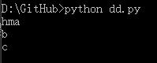
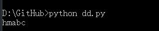

[How do I keep Python print from adding newlines or spaces?](http://stackoverflow.com/questions/255147/how-do-i-keep-python-print-from-adding-newlines-or-spaces)
======

* #### use `sys`
    ```py
    import sys
    sys.stdout.write('h')
    sys.stdout.write('m')
    string=['a','b','c']
    for i in string:
        #sys.stdout.write(i)
        print(i)
    ```
    输出结果：

    

    ```py
    import sys
    print('hello')
    sys.stdout.softspace=0
    print('world')
    print('!')
    ```


* #### use `end`,`sep`

  ```py
  print('h',end='')```
  to suppress the endline terminator,and

  ```py
  print('a','b','c',sep='')
  ```
  to suppress the whitespace separator between items.

  输出结果：

  


 * #### use module

 ```py
 from _past_ import printf ```
 where `_past_.py`contains:
 ```py
 import sys
 def printf(fmt,*varargs):
     sys.stdout.write(fmt % varargs)
 ```
 then
 ```py
    >>> printf("Hello, world!\n")
    Hello, world!
    >>> printf("%d %d %d\n", 0, 1, 42)
    0 1 42
    >>> printf('a'); printf('b'); printf('c'); printf('\n')
    abc
    >>>
 ```
